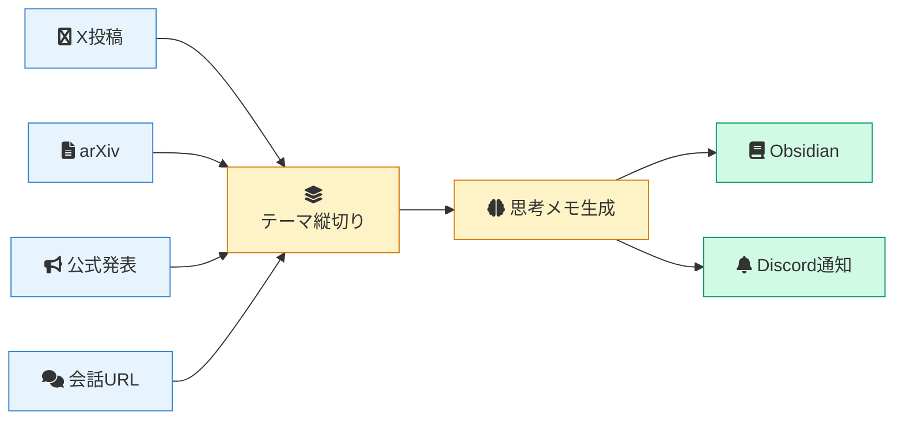
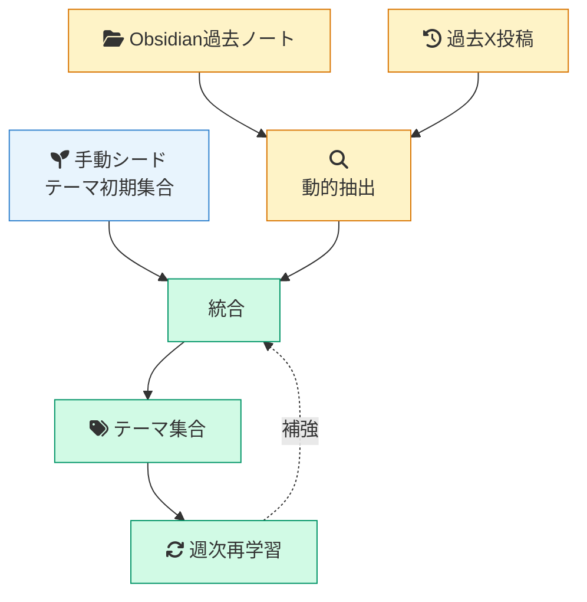
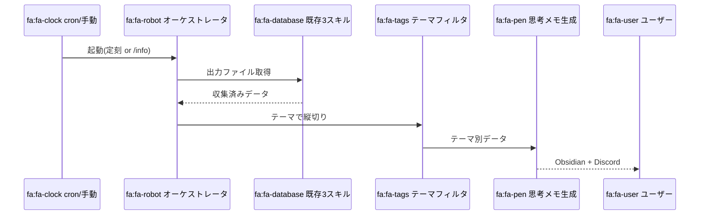
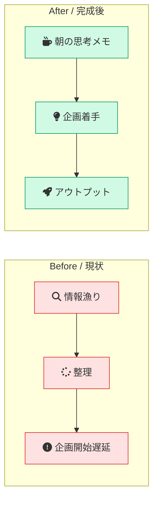
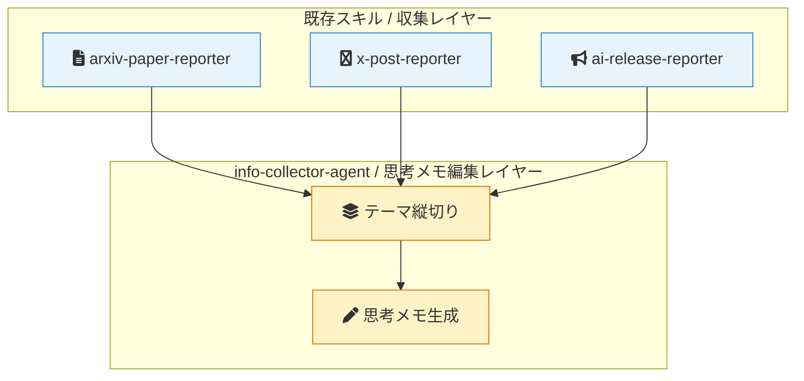

# 図解集（info-collector-agent）

各図に「言いたい一言」を1行付記。ノード数 7±2、日本語10文字以内、Font Awesome アイコン使用。

---

## 図1. 全体アーキテクチャ（オーケストレータ構造）

**言いたい一言**: 既存3スキルの出力を「関心テーマ」で縦切りにして思考メモに変える。

**凡例**: 青=情報源 / 黄=このスキルのコア / 緑=出力先

---

## 図2. テーマ抽出ハイブリッド構造（T3）

**言いたい一言**: 手動シードを動的補強し、週次でチューニングして暗黙知を追随する。

**凡例**: 青=静的入力 / 黄=動的抽出 / 緑=統合とフィードバック

---

## 図3. 日次パイプライン（毎朝の流れ）

**言いたい一言**: 定刻またはオンデマンドで起動し、テーマ単位の縦切り思考メモを朝に届ける。

**凡例**: 起動経路は2系統（cron / オンデマンド）、最終出力は2方向（Obsidian / Discord）

---

## 図4. Before / After（毎朝の風景）

**言いたい一言**: 「毎日ゼロから情報を漁る朝」が「思考メモから企画を書き始める朝」に変わる。

**凡例**: 赤=現状の摩擦 / 緑=完成後の理想

---

## 図5. 責務境界（既存スキル群との関係）

**言いたい一言**: 既存スキルは「収集の専門家」、このスキルは「思考メモの編集者」として住み分ける。

**凡例**: 青=既存資産（再利用） / 黄=新規責務（このスキルが担う領域）

---

## visualization-mandatory-rules チェック

- [x] ノード数 7±2 を全図遵守
- [x] 日本語ラベル10文字以内
- [x] 色凡例つき（青/黄/緑/赤の意味付き）
- [x] Font Awesome アイコン使用（絵文字なし）
- [x] 各図に「言いたい一言」付記
- [x] 専門用語は最小化（「縦切り」「思考メモ」など平易語）
