# ハンドオフ契約 JSON Schema

`skill-intake-handoff` SubAgent の最終出力 `intake.json` の正規スキーマ。`run-skill-create` はこの JSON を読み込んで Phase 0-0 を簡略化または飛ばす。

## ファイル配置

```
output/<skill-name-hint>/
├── intake.md            # 人間用・正本
├── intake.json          # skill-creator 用・副本（このスキーマ準拠）
├── notion-url.txt       # 公開後の Notion URL
├── notion-blocks.json   # dry-run 用 Notion ブロック JSON
└── self-update.json     # question-bank への追記候補
```

Slack ログは本スキルのスコープ外（差別化済み）。

## JSON Schema（draft-07）

```json
{
  "$schema": "http://json-schema.org/draft-07/schema#",
  "title": "IntakeResult",
  "type": "object",
  "required": [
    "schema_version",
    "skill_name_hint",
    "purpose",
    "user_profile",
    "five_axes",
    "workflow_pattern",
    "completed_sheets",
    "recommended_next"
  ],
  "properties": {
    "schema_version": { "type": "string", "const": "1.0.0" },
    "generated_at": { "type": "string", "format": "date-time" },
    "skill_name_hint": {
      "type": "string",
      "pattern": "^[a-z][a-z0-9-]*$",
      "description": "kebab-case 推奨スキル名 (最終決定は run-skill-create)"
    },
    "purpose": {
      "type": "object",
      "required": ["stated", "excavated", "jtbd"],
      "properties": {
        "stated":   { "type": "string", "description": "表層要望（原文）" },
        "excavated":{ "type": "string", "description": "5 Whys 等で掘った真の課題" },
        "jtbd": {
          "type": "object",
          "required": ["when", "want_to", "so_i_can"],
          "properties": {
            "when":     { "type": "string" },
            "want_to":  { "type": "string" },
            "so_i_can": { "type": "string" }
          }
        },
        "magic_wand_vision": { "type": "string" },
        "pain_stories": {
          "type": "array",
          "items": {
            "type": "object",
            "properties": {
              "when":          { "type": "string" },
              "what_happened": { "type": "string" },
              "felt":          { "type": "string" },
              "cost_minutes":  { "type": "number" }
            }
          }
        }
      }
    },
    "user_profile": {
      "type": "object",
      "required": ["technical_level", "role", "context"],
      "properties": {
        "technical_level": { "enum": ["非技術", "中級", "上級"] },
        "role":            { "type": "string" },
        "context":         { "enum": ["業務", "個人", "学習", "趣味"] },
        "constraints":     { "type": "array", "items": { "type": "string" } },
        "motivation":      { "type": "string" },
        "share_target":    { "enum": ["自分のみ", "少人数", "不特定多数", "顧客"] }
      }
    },
    "five_axes": {
      "type": "object",
      "required": ["output_target", "info_source", "share_target", "true_problem", "knowledge_assets"],
      "description": "5 軸: 4 軸 (出力先/情報源/共有相手/真の課題) + ナレッジ資産軸 (MUST)",
      "properties": {
        "output_target": {
          "type": "object",
          "properties": {
            "answer":   { "type": "string" },
            "depth":    { "enum": ["quick", "standard", "deep"] },
            "verified": { "type": "boolean" }
          }
        },
        "info_source":  { "$ref": "#/properties/five_axes/properties/output_target" },
        "share_target": { "$ref": "#/properties/five_axes/properties/output_target" },
        "true_problem": { "$ref": "#/properties/five_axes/properties/output_target" },
        "knowledge_assets": {
          "type": "object",
          "required": ["needed", "verified"],
          "properties": {
            "needed":   { "type": "boolean" },
            "verified": { "type": "boolean" },
            "depth":    { "enum": ["quick", "standard", "deep"] },
            "existing_sources": {
              "type": "array",
              "items": {
                "type": "object",
                "required": ["type", "location"],
                "properties": {
                  "type":     { "enum": ["notion", "obsidian", "memo", "chat_log", "file", "url", "book", "video", "other"] },
                  "location": { "type": "string" },
                  "summary":  { "type": "string" }
                }
              }
            },
            "external_inputs": {
              "type": "array",
              "items": {
                "type": "object",
                "properties": {
                  "title":   { "type": "string" },
                  "url":     { "type": "string" },
                  "purpose": { "type": "string" }
                }
              }
            },
            "tacit_knowledge": { "type": "array", "items": { "type": "string" } },
            "extraction_pipeline": {
              "type": "object",
              "properties": {
                "needed":           { "type": "boolean" },
                "ingest_format":    { "type": "string" },
                "analysis_method":  { "type": "string" },
                "storage":          { "type": "string" },
                "retrieval":        { "type": "string" },
                "update_frequency": { "enum": ["fixed", "manual", "weekly", "monthly", "on_demand"] }
              }
            },
            "exclusions": { "type": "array", "items": { "type": "string" } }
          }
        }
      }
    },
    "workflow_pattern": {
      "enum": ["A", "B", "C", "D", "E"],
      "description": "A=対話生成 / B=自動収集配信 / C=対話契約書 / D=分析レポート / E=その他"
    },
    "completed_sheets": {
      "type": "array",
      "items": {
        "type": "object",
        "required": ["section_id", "title", "status"],
        "properties": {
          "section_id": { "type": "string" },
          "title":      { "type": "string" },
          "status":     { "enum": ["complete", "partial", "skipped"] },
          "filled_at":  { "type": "string", "format": "date-time" }
        }
      }
    },
    "open_questions": {
      "type": "array",
      "items": {
        "type": "object",
        "properties": {
          "question":    { "type": "string" },
          "blocking":    { "type": "boolean" },
          "deferred_to": { "enum": ["skill-creator", "later"] }
        }
      }
    },
    "recommended_next": {
      "type": "object",
      "required": ["mode", "skip_to_phase"],
      "properties": {
        "mode":          { "enum": ["full", "fast-track", "verify-only"] },
        "skip_to_phase": { "type": "string" },
        "rationale":     { "type": "string" }
      }
    },
    "visualizations": {
      "type": "array",
      "items": {
        "type": "object",
        "required": ["type", "section", "svg_path", "one_liner"],
        "properties": {
          "type": {
            "enum": [
              "flowchart", "sequence", "state", "class", "er", "gantt",
              "pie", "mindmap", "timeline", "journey", "quadrant", "sankey",
              "numbered-steps", "persona-card", "before-after",
              "comparison-table", "traffic-light", "progress-bar",
              "icon-grid", "sankey-aux"
            ]
          },
          "section":        { "type": "string" },
          "svg_path":       { "type": "string" },
          "png_path":       { "type": "string" },
          "one_liner":      { "type": "string", "maxLength": 60 },
          "non_tech_score": { "type": "integer", "minimum": 1, "maximum": 3 }
        }
      }
    }
  }
}
```

## 必須フィールド最小例（google-forms-generator）

```json
{
  "schema_version": "1.0.0",
  "skill_name_hint": "google-forms-generator",
  "purpose": {
    "stated": "申込フォームを自動で作りたい",
    "excavated": "セミナー告知の 3 日前に 5 分でフォームと集計まで完了させ、SNS 拡散に時間を回したい",
    "jtbd": {
      "when": "セミナー告知の 3 日前",
      "want_to": "申込フォームを 5 分で作る",
      "so_i_can": "SNS 拡散に時間を回せる"
    }
  },
  "user_profile": { "technical_level": "中級", "role": "個人事業主", "context": "業務", "share_target": "不特定多数" },
  "five_axes": {
    "output_target": { "answer": "Google Forms + Sheets", "depth": "standard", "verified": true },
    "info_source":   { "answer": "セミナー概要メモ (手元)", "depth": "standard", "verified": true },
    "share_target":  { "answer": "セミナー参加希望者", "depth": "standard", "verified": true },
    "true_problem":  { "answer": "告知準備 90 分→10 分", "depth": "deep", "verified": true },
    "knowledge_assets": { "needed": true, "verified": true }
  },
  "workflow_pattern": "A",
  "completed_sheets": [{ "section_id": "purpose", "title": "目的", "status": "complete" }],
  "recommended_next": { "mode": "fast-track", "skip_to_phase": "Phase 1", "rationale": "5 軸全充足" }
}
```

## バリデーション

- `scripts/validate_intake.py` が schema 準拠を検証
- 必須欠落 → ヒアリング差し戻し
- `five_axes.*.verified=false` が 1 つでも残れば `recommended_next.mode="full"` 強制
- `knowledge_assets.verified` は **MUST**（false は不可、`needed=false` の verified=true は OK）

## skill-creator 入力契約マッピング

`run-skill-create` (`plugins/skill-creator/skills/run-build-skill/SKILL.md`) は本 intake.json を入力として Step 1 を簡略化または飛ばす。本スキルが生成する §0〜§11 と skill-creator 9 ステップ (Step 1〜9; Step 3.5 / Step 7.5 含み合計 11 ステップだが正規 9 セクション) の対応は以下のとおり。

| skill-intake §x (canonical_map) | intake.json フィールド | skill-creator Step / 入力 | 役割 |
|---|---|---|---|
| §0 executive_summary | `meta` + `purpose.excavated` + `recommended_next.mode` | Step 1 要求ヒアリング (skip_to_phase 判定の根拠) | スキル名候補・パターン・引き渡しモードを 1 枚で読ませる |
| §1 assumption_challenger | `purpose.stated` / `purpose.excavated` | Step 1 要求ヒアリング (kind 確定の前提) | 表層 vs 深層の分離をそのまま brief に渡す |
| §2 user_profile | `user_profile.technical_level` / `role` / `context` / `share_target` | Step 1 要求ヒアリング (語彙難易度・テンプレ選択へ反映) | vocabulary_tier を Step 2 のテンプレ展開に伝搬 |
| §3 purpose_excavator | `purpose.excavated` / `purpose.jtbd` / `purpose.magic_wand_vision` | Step 1 要求ヒアリング (true_purpose 正本) | Step 5 フォーク評価のスコア対象 |
| §4 option_presenter | `five_axes.*` の adopted 選択肢 + connectors | Step 2 テンプレ展開 / Step 3 補助ファイル生成 (config / references の初期値) | kind / 配置 / 連携先の事前確定 |
| §5 visualizer (図解 5 枚) | `visualizations[]` (svg_path / type / one_liner) | Step 3 補助ファイル生成 (`templates/`, `assets/` への配置候補) | 図解資産を skill 本体へ移植可能化 |
| §6 five_axes_summary | `five_axes` (5 軸全部 + knowledge_assets MUST) | Step 1 要求ヒアリング / Step 6 ゲート判定 | 5 軸全充足が rubric score >= 80 の前提 |
| §7 design_decisions | (intake.json には未明示, §4 adopted を集約) | Step 2 テンプレ展開 (kind / pair / hooks の宣言値) | frontmatter の `pair` / `kind` / `script_refs` の初期値 |
| §8 open_questions | `open_questions[]` (blocking / deferred_to) | Step 1 要求ヒアリング (deferred_to=skill-creator を Step 1 で再尋問) | blocking=true の存在で Step 6 ゲートを停止 |
| §9 handoff_contract | `recommended_next` (mode / skip_to_phase / rationale) | Step 1 → Step 2 のジャンプ条件 (mode=fast-track なら Step 1 を簡略化) | skill-creator の起点 phase を機械決定 |
| §10 self_updater | `self-update.json` (question-bank 追記候補, value_realized_score) | (skill-creator スコープ外。skill-intake 自己進化のみ) | 次回 intake の質問銀行に反映 |
| §11 artifact_index | `output/<hint>/` 配下ファイル一覧 | Step 3.5 再現性トレース (skill-build-trace.json の source_docs に登録) | 生成物の所在を build-trace に固定 |

skill-creator Step 1 が読むのは主に §1/§2/§3/§6/§8/§9。Step 2 が読むのは §4/§7。Step 3 が読むのは §5/§11。それ以外 (§0/§10) は人間レビュー専用。

## `run-skill-elicit` との互換

`run-skill-elicit` が生成する brief.json も、本スキーマの `five_axes` 部分を空オブジェクトとして許容することで吸収できる。`run-skill-create` 側は両者を区別せず読み込めるよう、本スキーマを上位互換として運用する。

## 12 Agent × 出力 × Script 依存 DAG

実線矢印 = ファイル依存（前工程の出力を入力とする）。点線矢印 = script 呼出（agent → scripts/*.py）。subgraph はフェーズ区分。

```mermaid
flowchart TD
    subgraph P0[Phase 0 起動]
        A_kickoff(["kickoff"])
        F_kickoff["kickoff.json"]
        A_kickoff --> F_kickoff
    end

    subgraph P1[Phase 1 仮説と表層充足]
        A_assumption(["assumption-challenger"])
        F_assumption["assumption.json"]
        A_profiler(["user-profiler"])
        F_profile["profile.json"]
        A_interviewer(["interviewer"])
        F_sheet["sheet.md"]
        A_assumption --> F_assumption
        A_profiler --> F_profile
        A_interviewer --> F_sheet
    end

    subgraph P2[Phase 2 深層と選択肢]
        A_purpose(["purpose-excavator"])
        F_purpose["purpose.json"]
        A_option(["option-presenter"])
        F_options["connector_choice.json / options.json"]
        A_purpose --> F_purpose
        A_option --> F_options
    end

    subgraph P3[Phase 3 図解と要約]
        A_visualizer(["visualizer"])
        F_visuals["visuals.json + visuals/*.svg"]
        A_summarizer(["summarizer"])
        F_summary["summary.md / summary.json"]
        A_visualizer --> F_visuals
        A_summarizer --> F_summary
    end

    subgraph P4[Phase 4 判定と統合]
        A_next(["next-action-advisor"])
        F_next["next-action.json"]
        A_handoff(["handoff"])
        F_intake["intake.md / intake.json"]
        A_next --> F_next
        A_handoff --> F_intake
    end

    subgraph P5[Phase 5 公開]
        A_notion(["notion-publisher"])
        F_notion["notion-blocks.json / notion-manifest.json / notion-url.txt"]
        A_notion --> F_notion
    end

    subgraph P6[Phase 6 自己進化]
        A_self(["self-updater"])
        F_self["self-update.json / question-bank.md 追記"]
        A_self --> F_self
    end

    %% ファイル依存（実線）
    F_kickoff --> A_assumption
    F_kickoff --> A_profiler
    F_assumption --> A_profiler
    F_profile --> A_interviewer
    F_sheet --> A_purpose
    F_purpose --> A_option
    F_sheet --> A_visualizer
    F_purpose --> A_visualizer
    F_kickoff --> A_summarizer
    F_assumption --> A_summarizer
    F_profile --> A_summarizer
    F_sheet --> A_summarizer
    F_purpose --> A_summarizer
    F_options --> A_summarizer
    F_visuals --> A_summarizer
    F_summary --> A_next
    F_purpose --> A_next
    F_options --> A_next
    F_kickoff --> A_next
    F_kickoff --> A_handoff
    F_assumption --> A_handoff
    F_profile --> A_handoff
    F_sheet --> A_handoff
    F_purpose --> A_handoff
    F_options --> A_handoff
    F_visuals --> A_handoff
    F_summary --> A_handoff
    F_next --> A_handoff
    F_intake --> A_notion
    F_visuals --> A_notion
    F_summary --> A_notion
    F_next --> A_notion
    F_intake --> A_self
    F_summary --> A_self
    F_next --> A_self

    %% Script 呼出（点線）
    A_handoff -.-> S1[/"render-intake-final.py"/]
    A_handoff -.-> S2[/"convert_md_to_json.py"/]
    A_handoff -.-> S3[/"validate_intake.py"/]
    A_handoff -.-> S4[/"check_completeness.py"/]
    A_handoff -.-> S5[/"detect_contradictions.py"/]
    A_handoff -.-> S6[/"extract_open_questions.py"/]
    A_handoff -.-> S7[/"cross_check.py"/]
    A_visualizer -.-> S8[/"select_diagrams_per_section.py"/]
    A_visualizer -.-> S9[/"compose_diagram.py"/]
    A_visualizer -.-> S10[/"validate_mermaid.py"/]
    A_visualizer -.-> S11[/"render_to_svg.py"/]
    A_visualizer -.-> S12[/"enforce_visualization_rules.py"/]
    A_notion -.-> S13[/"keychain_get_secret.py"/]
    A_notion -.-> S14[/"verify_notion_schema.py"/]
    A_notion -.-> S15[/"render_to_image.py"/]
    A_notion -.-> S16[/"prepare_notion_assets.py"/]
    A_notion -.-> S17[/"verify_notion_assets.py"/]
    A_notion -.-> S18[/"intake_publish_pipeline.py"/]
    A_self -.-> S19[/"measure_value_realized.py"/]
    A_self -.-> S20[/"update_question_bank.py"/]
    A_self -.-> S21[/"append_eval_log.py"/]
```



凡例:
- 楕円 `()` = agent ノード（12 個）。
- 矩形 `[]` = 中間/最終ファイル。
- 平行四辺形 `[/.../]` = scripts/*.py 呼出。
- 実線 = ファイル依存、点線 = script 呼出。
